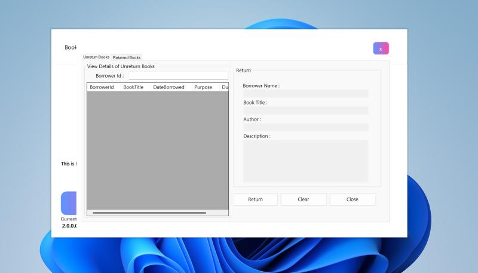
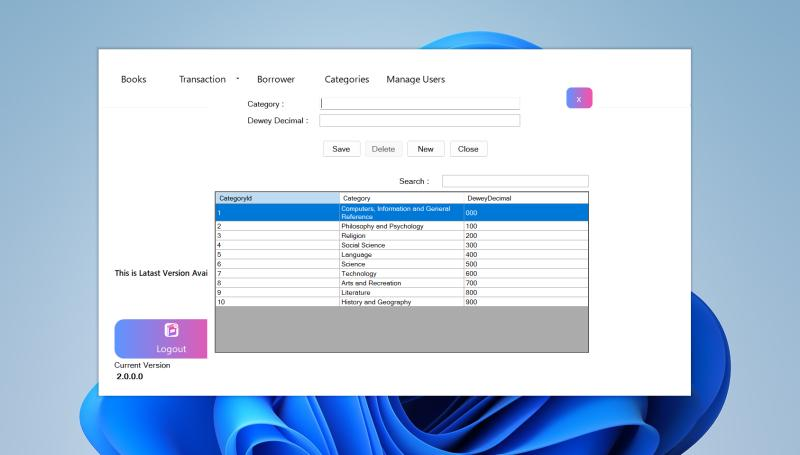
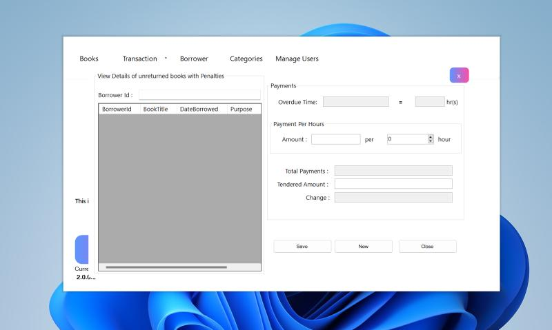

<h2>Library Management System</h2>
A Library Management System that I made using C#, .NET and Windows Forms. This project was made just for fun in a week of time when I learned C# so that I can make something tangible. It implements all the checks so that there is no erros when books are added, removed, issued from the database etc.

 

 

  
  
   
  
  
  

